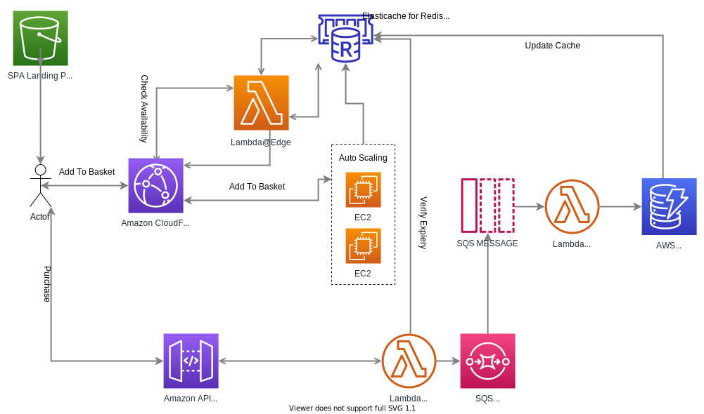
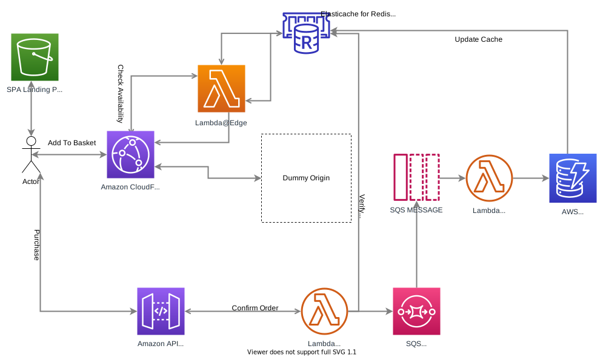
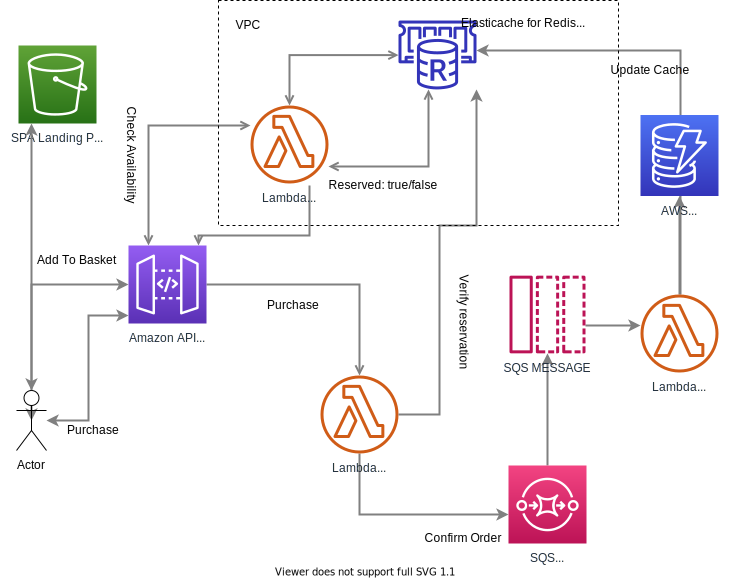

# Concurrency issue on an e-commerce website
On an e-commerce website, there is a product and 50 of them are available. You have to design a system - DB(relational) and application design including APIs (noo need to document the spec) so that only the first 50 people who add to the basket and buy it get the product. Imagine there are 50,000 concurrent users looking at the same product and trying to buy it. Once an item is added to the basket, it is locked down to that user. The user then has 10 mins to complete the purchase. After 10 mins, if not purchased, it will be made available to the next available user.

Version 0
------
The problem can be divided into two separate ones:
1. A solution to execute as close to the customer and provide a lightning-fast response about availability.
2. A solution to solve database concurrency issues in case we have multiple orders in the same millisecond.

###Solving problem 1:
Considering the latest AWS services, for Problem 1, we can use:
* Cloudfront with Auto Scaling EC2/ECS to process.
* Lambda Edge to be executed directly before the user request hit the CloudFront and work with In-Memory Database such as Redis.
* In-Memory Database such as Redis / Hazelcast / Aerospike / Other

For the current example, we use Redis.

####User Flow:
User will hit CloutFront and request **"AddToCart"** action for the specific product.
Lambda@Edge function will execute in front of CloudFront and query availability directly from the In-Memory Database.
If there is availability, A record with an expiry key will be registred in Redis and the request will be modified with this information.
When the request reaches its destination (custom origin, ECS, EC2, etc...) the specific service worker will be able to identify the same record and query it's expiry date directly in Redis. This way we implement a two-factor check on availability and eligibility of the action.

###Solving problem 2:
Once we have items in the customer cart, we allow X amount of time for the user to complete the transaction (Redis expire key). The checkout and save into the database can happen in a few stages with the following AWS services:
1. API Gateway / Or Cloudfront with API Gateway origin.
2. Lambda
3. SQS FIFO Queue
4. Persistent database storage: DynamoDB / RDS

On Checkout and before actual payment, APi Gateway will trigger a Lambda function which will verify the item has not expired and confirm the transaction.
Once this is completed, the same Lambda function will submit the order as a message in a FIFO queue using SQS, which will be processed by another Lambda function at the other end and save the record into appropriate database.

The reason and motivation to use SQS which may seem as an overkill is to solve database concurrency issue. The proposition is for the SQS lambda worker to save into the database both the timestamp of when the item was added into cart (taken from Redis) and the timestamp of the actual transaction (payment).
FIFO (First-In-First-Out) queues are designed to enhance messaging between applications when the order of operations and events is critical, or where duplicates can't be tolerated, so they seems to be a natural choice to solve our problem.

Here is a verison 0 of how our architecture may look like:
 

Version 1
------
### Taking the idea further
THis looks like a complicated prototype of architecture, but we should always keep asking ourselves, what can we improve, and how can we minimize the costs of our solutions.

What if we remove the CloudFront origin completely?
As we know, we can use Lambda@Edge for both Request and Responses and providing the fact we already save the data into our In-Memory Database, a valid question would be: Do we really need to have an origin?
Well, it seems like CloudFront will not operate without one, but I guess we can always put a dummy one which will cost us $0?
Sure in this scenario we loose the 2 step verification, but do we really need this providing the fact we do verify before we authorise the transaction?
We potentially will need two Lamda@Edge functions - one for request and one for the response, but still this will be efficient and should reduce our costs.

Let's see how the new architecture will look like:

Version 1
------
### Simplifying and optimizing.

OK, so far so good, but there is one potential issue in our architecture:
For Lambda@Edge to be able to communicate with another service such as Redis, it may require a VPC Setup and ENI attachment (Elastic Network Interface).
This could significantly impact the cold start of the function, which in some cases can be crucial.
Does Lambda@Edge support VPC and ENI same way as a normal Lambda?

** Note to myself: You should have checked before you wrote so much text and diagrams! **

Another valid question would be: Do we really need CloudFront? It seems we are only using it to trigger Lambda@Edge.

So...
Let's see if we can come up with something simpler, cheaper that will do the same work for us!
I came up with something like this, which is my final solution for the day.

In this architecture we have completely removed CloudFront and Lambda@Edge, sacrificing a little bit of time when the user requests the AddToCart action, for the sake of a simplified and cheaper solution.

